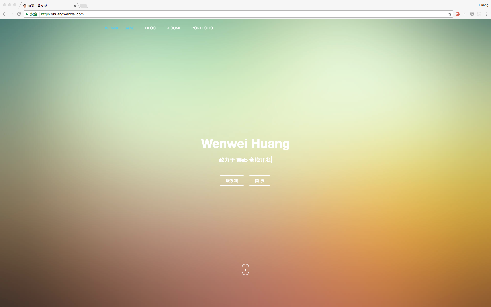
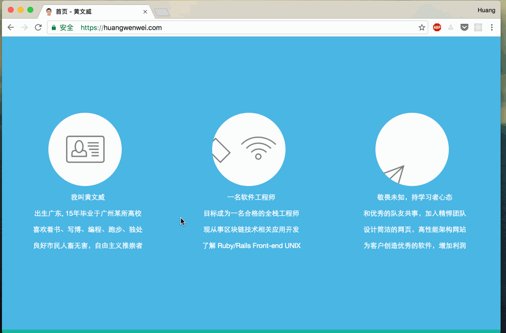
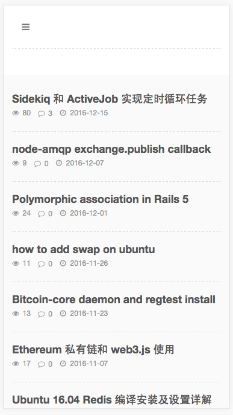
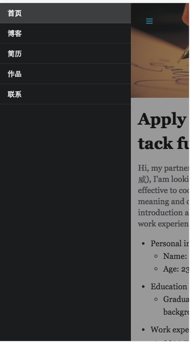

# PBlog
A awesome personal website based on Ruby on Rails and Semantic-UI
## Features
- SEO friendly
- Manage you posts and resume
- Simple and elegant responsive UI
- The source code clearly for Ruby on Rails to study
- Manage comments, contract messages on you own without any limit

## Getting Started
Now, with a few command and modify some description, you can own a geek personal webpage, here we go.
### Prerequisites
PBlog is a Ruby on Rails webApp. We assume a live *nix service with Rails environment.

- Ruby (>2.3.1)
- Mysql (> 14)
- Nginx
- Redis
- [pow](https://github.com/basecamp/pow) a tool for MacOS user developer Rack App
  > not necessary (Zero-configuration Rack server for MacOS)

## installing
A step by step introduce to run in local machine and deploy to server. Deadly simple! 😂

```
// modify config/database.yml configuration
git clone https://github.com/wenweih/PBlog.git
cd PBlog
bundle install
rails db:setup
```

### Development
- Pow: ```ln -s the_path_of_PBlog ~/.pow/blog```
  now you can visit ```blog.dev```
- or ```rails s```
  now you can visit ```localhost:3000```

### Production
[Capistrano](http://capistranorb.com) is a best tool to deploy Rails project.
before deploy, you should modify ```config/app.example.yml``` and,  ```config/database.example.yml``` to fix your own. and then modify server ip in ```config/deploy/production.rb``` file.
run flow command int your repo root directory:
```shell
bundle exec cap production deploy:config  // upload config to server
bundle exec cap production puma:config    // upload puma config to server
bundle exec cap production deploy         // clone and compile static assets and db migrate
bundle exec cap production deploy:restart // start blog service
```

## Screenshot
PC





Mobile




